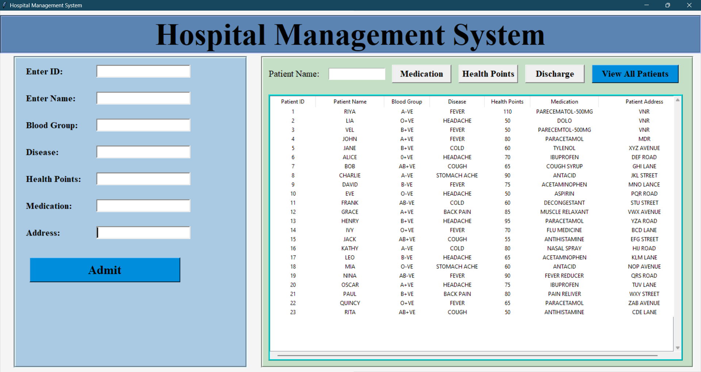

# Tkinter Hospital Management System

A graphical user interface (GUI) application built using Python's Tkinter library to manage hospital operations efficiently.

## Table of Contents

- [Overview](#overview)
- [Installation](#installation)
- [Screenshots](#screenshots)
- [Technologies Used](#technologies-used)
- [Contributing](#contributing)
- [License](#license)

## Overview

The Tkinter Hospital Management System is a desktop application that helps hospitals manage various operations such as patient registration.


## Installation

1. **Clone the repository**:
    ```bash
    git clone https://github.com/Murugavl/Tkinter-Hospital_Management_System.git
    ```
2. **Navigate to the project directory**:
    ```bash
    cd Tkinter-Hospital_Management_System
    ```
3. **Install required dependencies**:
    ```bash
    pip install -r requirements.txt
    ```
    

4. **Run the application**:
    ```bash
    python main.py
    ```

## Screenshots



## Technologies Used

- **Python**: The main programming language.
- **Tkinter**: For building the GUI.
- **MongoDB**: For database management 


## Contributing

Contributions are welcome! Please follow these steps to contribute:

1. **Fork the repository**.
2. **Create a new branch**: 
    ```bash
    git checkout -b feature/YourFeatureName
    ```
3. **Commit your changes**:
    ```bash
    git commit -m 'Add some feature'
    ```
4. **Push to the branch**:
    ```bash
    git push origin feature/YourFeatureName
    ```
5. **Submit a pull request**.

## License

This project is licensed under the MIT License - see the [LICENSE](LICENSE) file for details.

